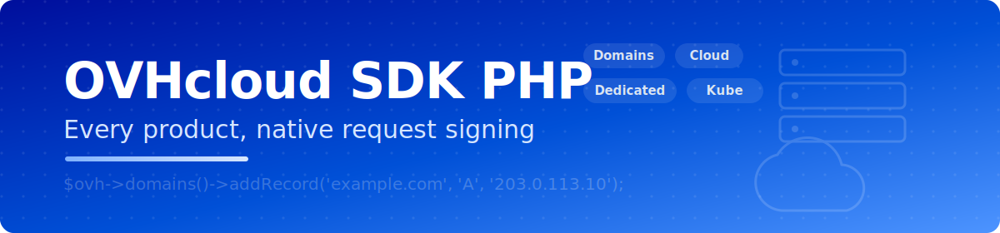

<div align="center">



# ☁️ OVHcloud SDK for PHP

**A modern, fully typed PHP SDK for the entire OVHcloud API — every product, native request signing, no wrapper dependency.**

[](https://www.php.net/)
[](https://symfony.com/)
[](tests/)
[](#api-reference)
[](LICENSE)

*Domains & DNS · Public Cloud · Dedicated · VPS · Kubernetes · Web Hosting · Email · IP · vRack · Load Balancer · SMS*

[Installation](#installation) · [Authentication](#authentication) · [API Reference](#api-reference) · [Error Handling](#error-handling)

</div>

---

```php
$ovh = new Ovh(new OvhClient($appKey, $appSecret, $consumerKey));

$ovh->domains()->addRecord('example.com', 'A', '203.0.113.10', 'www');
$ovh->cloud()->createInstance($projectId, ['name' => 'web01', 'flavorId' => '...', 'imageId' => '...']);
$ovh->dedicatedServers()->reboot('ns3000000.ip-1-2-3.eu');
```

Framework-agnostic core — usable from any PHP project, script, or worker — with an optional bundle for first-class Symfony integration. **The OVHcloud `$1$` request signature is implemented natively** (no dependency on the official `ovh/ovh` wrapper), with automatic clock-drift correction, typed exceptions, opt-in retries, and a comment-free, strictly typed codebase (PHP 8.2+, `declare(strict_types=1)` everywhere).

---

## Table of Contents

- [Features](#features)
- [Requirements](#requirements)
- [Installation](#installation)
- [Authentication](#authentication)
- [Quick Start (plain PHP)](#quick-start-plain-php)
- [Symfony Integration (optional)](#symfony-integration-optional)
- [Architecture](#architecture)
- [API Reference](#api-reference)
  - [Account (`me`)](#account-me)
  - [Domains & DNS](#domains--dns)
  - [Dedicated servers](#dedicated-servers)
  - [VPS](#vps)
  - [Public Cloud](#public-cloud)
  - [Managed Databases & Kubernetes](#managed-databases--kubernetes)
  - [Web Hosting](#web-hosting)
  - [Email](#email)
  - [IP](#ip)
  - [vRack](#vrack)
  - [Load Balancer](#load-balancer)
  - [CDN, Licenses, Orders, SMS, Logs, Support, VoIP](#cdn-licenses-orders-sms-logs-support-voip)
  - [Generic access](#generic-access)
- [Responses](#responses)
- [Error Handling](#error-handling)
- [Testing](#testing)
- [Security Notes](#security-notes)
- [WHMCS module](#whmcs-module)
- [License](#license)

---

## Features

| | |
|---|---|
| 🔐 **Native request signing** | The OVHcloud `$1$` SHA-1 signature scheme implemented from scratch — no `ovh/ovh` dependency — with lazy clock-drift correction against `/auth/time` |
| 🧩 **19 product modules** | One facade covering the whole `api.ovh.com/1.0` surface: domains, cloud, dedicated, VPS, Kubernetes, databases, hosting, email, IP, vRack, load balancers, CDN, licenses, orders, SMS, logs, support, VoIP |
| 🌍 **All endpoints** | `ovh-eu`, `ovh-ca`, `ovh-us`, `kimsufi-eu/ca`, `soyoustart-eu/ca` — pick yours or pass a custom base URL |
| 🎫 **Credential flow built in** | `requestCredentials()` mints a consumer key with the access rules you need and returns the validation URL |
| 🚨 **Production-grade errors** | 400/403/404/409/429 mapped to dedicated exceptions exposing OVHcloud's `errorCode`; opt-in automatic retries with backoff |
| 🔓 **Nothing sealed off** | The client's `get`/`post`/`put`/`delete` accept any path, and `me()->fetch()` / `cloud()->fetch()` reach any sub-resource, so 100% of the API is one call away |
| 🛠 **Framework-agnostic** | Only hard dependency is `symfony/http-client`; the optional Symfony bundle adds semantic config and autowiring |
| ✅ **Fully unit-tested** | 15 tests against `MockHttpClient`, including exact signature verification — no network required |

## Requirements

| Dependency | Version |
|---|---|
| PHP | >= 8.2 |
| OVHcloud | an application key + secret, and a consumer key ([create here](https://api.ovh.com/createToken/)) |
| Symfony | 6.4 LTS or 7.x — **optional**, only for the bundle integration |

## Installation

If the package is published on [Packagist](https://packagist.org/packages/chuckbartowski/ovh-sdk):

```bash
composer require chuckbartowski/ovh-sdk
```

## Authentication

OVHcloud signs every request with `X-Ovh-Signature: $1$` + `sha1(secret + "+" + consumerKey + "+" + method + "+" + url + "+" + body + "+" + timestamp)`. This SDK does all of it for you — you only provide three credentials:

- **Application key** + **Application secret** — identify your app ([create an application](https://api.ovh.com/createApp/)).
- **Consumer key** — identifies the authorization granted to your app on an account.

The fastest path is [api.ovh.com/createToken](https://api.ovh.com/createToken/) which gives you all three at once. To mint a consumer key programmatically with a chosen scope:

```php
$client = new OvhClient($appKey, $appSecret, null, 'ovh-eu');

$creds = $client->requestCredentials(
    accessRules: [
        ['method' => 'GET',    'path' => '/*'],
        ['method' => 'POST',   'path' => '/domain/*'],
        ['method' => 'DELETE', 'path' => '/domain/zone/*'],
    ],
    redirection: 'https://your-app.example.com/ovh/callback',
);

$consumerKey  = $creds->data('consumerKey');   // store this
$validationUrl = $creds->data('validationUrl'); // user opens this once to approve
```

The clock-drift correction is automatic: the first signed call fetches OVHcloud's server time from `/auth/time` and offsets every subsequent timestamp, so a skewed local clock never breaks the signature.

## Quick Start (plain PHP)

```php
use ChuckBartowski\OvhSdk\Client\OvhClient;
use ChuckBartowski\OvhSdk\Ovh;

$ovh = new Ovh(new OvhClient(
    applicationKey: getenv('OVH_APP_KEY'),
    applicationSecret: getenv('OVH_APP_SECRET'),
    consumerKey: getenv('OVH_CONSUMER_KEY'),
    endpoint: 'ovh-eu',
));

$account = $ovh->me()->info();
$ovh->domains()->addRecord('example.com', 'A', '203.0.113.10', 'www');
$ovh->domains()->refreshZone('example.com');
```

Client constructor signature:

```php
new OvhClient(
    string $applicationKey,
    string $applicationSecret,
    ?string $consumerKey = null,              // null → only requestCredentials() is allowed
    string $endpoint = 'ovh-eu',              // or a full custom base URL
    float $timeout = 30.0,
    bool $retryFailed = false,                // retry 429/5xx with exponential backoff
    int $maxRetries = 3,
    ?HttpClientInterface $httpClient = null,  // inject your own (proxy, scoped, mock…)
);
```

## Symfony Integration (optional)

Register the bundle, then create `config/packages/ovh_sdk.yaml`:

```yaml
ovh_sdk:
    application_key: '%env(OVH_APP_KEY)%'
    application_secret: '%env(OVH_APP_SECRET)%'
    consumer_key: '%env(OVH_CONSUMER_KEY)%'
    endpoint: 'ovh-eu'
    retry_failed: true
```

The `Ovh` facade is then autowirable in controllers, services, commands, and message handlers.

## Architecture

```
src/
├── OvhSdkBundle.php             Symfony bundle: config tree + service wiring (optional)
├── Ovh.php                      Facade: entry point for all modules
├── Client/
│   └── OvhClient.php            Native $1$ signing, clock-drift, endpoints, retries, credential flow
├── Response/
│   └── ApiResponse.php          Normalized response (+ items/first/as/asList helpers)
├── Exception/
│   ├── OvhSdkExceptionInterface.php   ApiException.php
│   ├── ResourceNotFoundException.php  ForbiddenException.php
│   ├── ConflictException.php          InvalidRequestException.php
│   ├── RateLimitException.php         AuthenticationException.php   TransportException.php
└── Api/
    ├── AbstractApi.php          MeApi.php            DomainApi.php        DedicatedServerApi.php
    ├── VpsApi.php               CloudApi.php         CloudDatabaseApi.php KubernetesApi.php
    ├── WebHostingApi.php        EmailApi.php         IpApi.php            VrackApi.php
    ├── LoadBalancerApi.php      CdnApi.php           LicenseApi.php       OrderApi.php
    └── SmsApi.php               DbaasLogsApi.php     SupportApi.php       VoipApi.php
```

## API Reference

Every method returns an [`ApiResponse`](#responses) and throws on failure. Service names (domains, VPS, dedicated servers…) are URL-encoded for you.

### Account (`me`)

`$ovh->me()` — `info()`, `update()`, `bills()` / `bill(id)`, `orders()` / `order(id)`, `paymentMethods()`, `contacts()`, SSH keys (`sshKeys`, `addSshKey`, `deleteSshKey`), API credentials (`apiApplications`, `apiCredentials`, `revokeCredential`), `iamPolicies()`, and `fetch(path)` for any other `/me/*` endpoint.

### Domains & DNS

`$ovh->domains()` — domain lifecycle (`list`, `find`, `serviceInfos`, `nameservers`, `updateNameservers`, `dnssec`) and the full DNS zone editor:

| Method | Endpoint |
|---|---|
| `zones()` / `zone(name)` | `/domain/zone` |
| `records(zone, filters)` / `record(zone, id)` | `/domain/zone/{zone}/record` |
| `addRecord(zone, fieldType, target, subDomain, ttl)` | `POST …/record` |
| `updateRecord(zone, id, fields)` / `deleteRecord(zone, id)` | `PUT`/`DELETE …/record/{id}` |
| `refreshZone(zone)` | `POST …/refresh` — **required to apply record changes** |
| `exportZone(zone)` | BIND export |

```php
$id = $ovh->domains()->addRecord('example.com', 'MX', '10 mail.example.com.', '')->data('id');
$ovh->domains()->refreshZone('example.com');
```

### Dedicated servers

`$ovh->dedicatedServers()` — `list`, `find`, `update`, `serviceInfos`, `hardware`, `network`, `reboot`, `reinstall(name, options)` + `installStatus`, `bootOptions`, `setMonitoring`, `ipmiAccess`, `interventions`, `tasks`.

### VPS

`$ovh->vps()` — `list`, `find`, `update`, power (`reboot`, `start`, `stop`), `reinstall(name, options)`, `images`, `ips`, snapshots (`snapshots`, `createSnapshot`), `disks`, `tasks`.

### Public Cloud

`$ovh->cloud()` — every method takes the `$projectId` first:

| Group | Methods |
|---|---|
| Projects | `projects()`, `project(id)`, `usageCurrent(id)` |
| Instances | `instances`, `instance`, `createInstance`, `deleteInstance`, `rebootInstance`, `startInstance`, `stopInstance`, `reinstallInstance`, `resizeInstance` |
| Volumes | `volumes`, `createVolume`, `deleteVolume`, `attachVolume`, `detachVolume`, `volumeSnapshots` |
| Catalog | `images`, `flavors`, `regions` |
| Network | `privateNetworks`, `createPrivateNetwork`, `publicNetworks` |
| Access | `sshKeys`, `addSshKey`, `users`, `createUser`, `storageContainers` |

Anything else on a project: `cloud()->fetch($projectId, '/…')`.

### Managed Databases & Kubernetes

`$ovh->cloudDatabases()` — `services(projectId)`, `list(projectId, engine)` (`postgresql`, `mysql`, `redis`, `mongodb`, `kafka`…), `create`, `deleteCluster`, `databases`, `users`, `createUser`, `backups`.
`$ovh->kubernetes()` — `clusters`, `cluster`, `create`, `update`, `deleteCluster`, `kubeconfig`, `reset`, node pools (`nodePools`, `createNodePool`, `updateNodePool`, `deleteNodePool`), `nodes`.

### Web Hosting

`$ovh->webHosting()` — `list`, `find`, attached domains, databases (`databases`, `createDatabase`), `cron`, `users`, SSL (`ssl`, `requestSsl`), `ovhConfigs`, `tasks`.

### Email

`$ovh->email()` — MX Plan (`domains`, `accounts`, `createAccount`, `deleteAccount`, `changePassword`, redirections, mailing lists) and Exchange (`exchangeServices`, `exchangeAccounts`).

### IP

`$ovh->ips()` — `list`, `find`, reverse DNS (`reverse`, `setReverse`, `deleteReverse`), `move`, `park`, firewall (`firewall`, `enableFirewall`, `firewallRules`, `addFirewallRule`), DDoS mitigation (`mitigation`, `enableMitigation`).

### vRack

`$ovh->vrack()` — `list`, `find`, and membership management: dedicated servers, cloud projects, IP blocks (`add`/`remove` for each).

### Load Balancer

`$ovh->loadBalancers()` — IPLB services: `frontends`/`createFrontend`, `backends`/`createBackend`, `servers`/`addServer`, `pendingChanges`, and `refresh()` to apply staged changes.

### CDN, Licenses, Orders, SMS, Logs, Support, VoIP

- `$ovh->cdn()` — dedicated & website CDN, domains, `flushCache`.
- `$ovh->licenses()` — Windows, cPanel, Plesk, DirectAdmin, Office licenses.
- `$ovh->orders()` — cart lifecycle (`createCart`, `addItem`, `checkout`) and public `catalog`.
- `$ovh->sms()` — `send(service, receivers, message)`, jobs, outgoing/incoming, senders.
- `$ovh->dbaasLogs()` — Logs Data Platform: streams, dashboards, inputs, aliases.
- `$ovh->support()` — tickets (`create`, `reply`, `close`, `messages`).
- `$ovh->voip()` — Telephony: billing accounts, lines, numbers, consumption, `click2Call`.

### Generic access

Any endpoint not wrapped by a module stays one call away — signing, endpoint and error handling still apply:

```php
$ovh->client()->get('/dedicated/nasha');
$ovh->client()->post('/cloud/project/'.$id.'/ai/notebook', $payload);
```

## Responses

```php
$response = $ovh->domains()->records('example.com');

$response->success;       // bool
$response->statusCode;    // int
$response->data;          // decoded JSON (OVHcloud often returns arrays of IDs)
$response->items();       // list form, e.g. [12, 34, 56]
$response->first();       // first item or null
$response->errorCode;     // OVHcloud error code on failure, e.g. 'NOT_FOUND'
$response->as(Model::class);      // hydrate a single object (bring your own model)
$response->asList(Model::class);  // hydrate a collection
```

Note the OVHcloud idiom: list endpoints usually return **arrays of identifiers** (record IDs, service names), which you then fetch individually — `records()` returns IDs, `record($zone, $id)` returns the detail.

## Error Handling

All SDK exceptions implement `OvhSdkExceptionInterface`:

| Exception | Thrown when | Extras |
|---|---|---|
| `ApiException` | The API reported a failure (modules validate automatically) | `getErrors()`, `getStatusCode()`, `getErrorCode()`, `getRaw()` |
| ↳ `InvalidRequestException` | HTTP 400 (bad parameters, invalid signature…) | |
| ↳ `ForbiddenException` | HTTP 403 (consumer key lacks the access rule) | |
| ↳ `ResourceNotFoundException` | HTTP 404 | |
| ↳ `ConflictException` | HTTP 409 | |
| ↳ `RateLimitException` | HTTP 429 | |
| `AuthenticationException` | Missing credentials, or HTTP 401 (invalid/expired consumer key) | thrown *before* any request when credentials are missing |
| `TransportException` | Network error, TLS failure, timeout, or invalid JSON | wraps the `symfony/http-client` exception |

```php
try {
    $ovh->domains()->deleteRecord('example.com', $id);
} catch (ForbiddenException) {
    // consumer key was not granted DELETE on /domain/zone/*
}
```

## Testing

The suite runs entirely offline against `MockHttpClient` — including a test that recomputes the `$1$` signature byte-for-byte:

```bash
composer install
vendor/bin/phpunit
```

## Security Notes

- The application secret and consumer key are passed with `#[\SensitiveParameter]`, so they never appear in stack traces.
- Scope consumer keys tightly with `accessRules` — grant `GET /domain/*`, not `ALL /*`, when a service only reads domains.
- Keep credentials in `.env.local` or your secret vault — never commit them.
- Destructive calls (`deleteInstance`, `deleteRecord`, `deleteCluster`, dedicated `reinstall`) are irreversible — gate them behind confirmation flows.

## WHMCS module

A ready-to-use **WHMCS registrar module** ships in [`whmcs/modules/registrars/ovhsdk/`](whmcs/modules/registrars/ovhsdk). It plugs OVHcloud domains into WHMCS's DNS and nameserver management through this SDK.

**Install**

1. `composer require chuckbartowski/ovh-sdk` in your WHMCS root.
2. Copy the `ovhsdk` folder into `<whmcs>/modules/registrars/`.
3. Activate *OVHcloud (SDK)* in *System Settings » Domain Registrars* and enter your **application key / secret / consumer key** and endpoint.

| WHMCS action | SDK call |
|---|---|
| Get / Save nameservers | `domains()->records(... NS)` / `updateNameservers()` |
| Get DNS records | `domains()->records()` + `record()` (MX priority split out) |
| Save DNS records | replace all records, then `refreshZone()` |

Domain **registration and transfers** go through OVHcloud's order cart (`orders()`), which is a multi-step purchase flow — the registrar hooks above cover the day-to-day DNS management that WHMCS drives automatically.

## License

MIT
